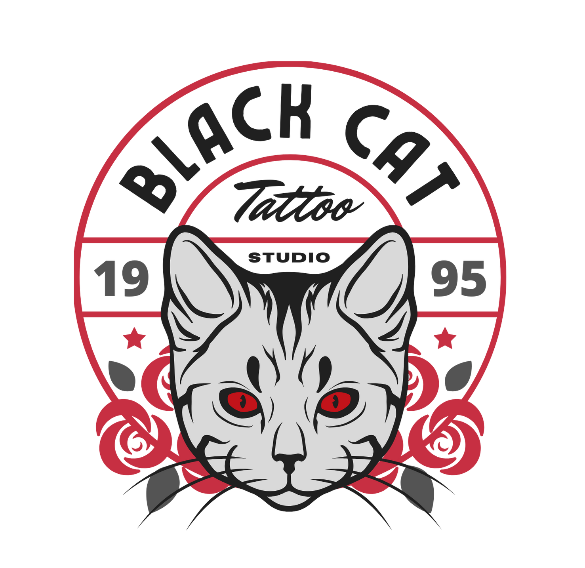

# Proyecto de frontend

##  BLACK CAT 
##  Tattoo Studio 

 Este es el frontend del sistema de gestion de citas de un estudio de tatuaje. Este proyecto se realizó como parte del Bootcamp Full Stack Developer de 

## Tecnologias Utilizadas

## Tabla de Contenidos
- 👁️‍🗨️[Vistas](#vistas)
- ⚙️[Instalacion en local](#einstalacion-en-local)
- 🛠️[Posibles Mejoras](#posibles-mejoras)
- 💻[Contacto](#contacto)
- 🪪[Creditos](#creditos)

## Descripcion 

El frontend desarrollado con React se centra en la gestión de citas para un estudio de tatuajes. La aplicación permite registrarse, que los tatuadores creen turnos disponibles y que los usuarios tomen o cancelen citas de manera eficiente.

## Vistas

#### Inicio de Sesión:

Autenticación de usuarios, con la capacidad de iniciar sesión como tatuador o usuario.

#### Panel de Tatuador:

Creación de turnos disponibles: Los tatuadores pueden especificar fechas y horarios para los turnos disponibles.

#### Reservas de Citas:

Los usuarios pueden visualizar los turnos disponibles y reservar citas indicando el motivo de la cita (tatuaje o piercing).

#### Cancelación de Citas:

Funcionalidad para que los usuarios cancelen citas existentes si es necesario.

Diseño limpio que facilita la navegación tanto para tatuadores como para usuarios.

#### Vista como super_admin:

El super admin puede iniciar sesion y obtener informacion de todos los clientes, tatuadores, citas disponibles y citas agendadas.

## Instalacion en local

1. Clonar el repositorio con el comando `$ git clone [URL del repositorio]`
2. Instalar dependencias con el comando` $ npm install `
3. Iniciar en desarrollo con `$ npm run dev`

## Posibles mejoras
🔹 Poder actualizar datos de los usuarios desde la vista del perfil 
🔹 Busqueda dinamica de citas y tatuadores 
🔹 Bloqueo en calendario de festivos o dias puntuales 
🔹 Asignarle rol de tatuador a un usuario como super_admin 

## Contacto

## Creditos
Este proyecto ha sido realizado por mi, Vanessa Brito, como parte del Bootcamp Full Stack Developer de 